I finally built a small but practical IoT project with a Raspberry Pi Pico W and MicroPython: a humidity and temperature monitor that reads a sensor every few seconds, shows the values locally on an LCD display, and periodically publishes readings via MQTT to Azure, where they are stored in a NoSQL database.

I wanted hands-on experience with MicroPython, Pico GPIO/I2C, the MQTT protocol, Azure integration, and Azure Cosmos DB, so I followed the classic "make it work, then make it pretty" approach. Spoiler alert: I am still in the "make it work" phase. The beautification and code refactoring will come in time, along with proper assembly on a prototype soldering board.

The goal of the program is simple: keep reading temperature and humidity values from a sensor, display the data on an LCD so I can check it locally, and every 60 seconds or so send an MQTT message to Azure IoT Hub. From there, the message content is saved in Azure Cosmos DB.

Some of the reasons that led me to choose this technical path:

1. At home, I have used Raspberry Pis (Model 4B) for quite some time, both as a limited desktop environment for web browsing and light programming, and also for a small Kubernetes cluster, but that is another story. Since Raspberry Pi uses a Debian-based operating system, it supports tools such as Visual Studio Code, Arduino, and Thonny. For that reason, I decided to stay within the Raspberry Pi ecosystem for this project and chose the Raspberry Pi Pico W. It was inexpensive and had enough resources for what I wanted to build.

2. The next question was which programming language to use. I have always liked C and its syntax, which is one reason I also like C#. I found the official Raspberry Pi Pico W SDK in C (https://www.raspberrypi.com/documentation/microcontrollers/c_sdk.html), and it would have been interesting to relive my university days when everything was written in C. Still, I decided I needed a prototype that I could develop and run without wasting too much time. After searching online, MicroPython stood out as a very common choice for Raspberry Pi Pico W projects. From what I saw, many of the capabilities I needed, such as HTTP requests and Wi-Fi support, were already included. For MQTT, I also found plenty of examples, and ChatGPT helped along the way.

3. The project could have been something that ran locally and only displayed the data, but I wanted to learn how to use the MQTT protocol and see what Azure could offer for my needs. After a little research, I found Azure IoT Hub. The free tier was also appealing because it allows 8,000 messages per day. I currently have three devices running, each sending one message per minute. That means each device generates about 60 messages per hour x 24 hours per day = 1,440 messages per day. So three devices generate 4,320 messages per day, which is comfortably below the 8,000-message daily limit. Wonderful.

4. Once the data was reaching Azure, the next question was where to store it. I could have saved it to Blob Storage, for example, but for many years I had wanted to use a NoSQL database and kept postponing the opportunity. In every project I had worked on until then, SQL relational databases were used. I decided this was the right moment to try something different. I knew NoSQL databases were schema-less, but I wanted to understand the practical implications for querying, indexing, and calculations compared with a relational database. At the time, Azure was also offering 250 GB for free per subscription and, if I kept usage below 1,000 RU/s, there would be no service cost. Great, no more excuses. Better to have 250 GB on Azure than only 1 GB elsewhere, and I genuinely enjoy working with Azure.

5. The only part I left for later was how to display the collected data in a more user-friendly way. Right now, I query it directly in Azure Cosmos DB Data Explorer, which is good enough for the moment and can be improved later.

After choosing the technology stack, the next question was: what system requirements did I want to implement?

1. One requirement had already been decided. Aside from the hardware investment, which is a one-time cost unless replacements are needed, I did not want an expensive hobby that would generate monthly bills. So I created an Azure IoT Hub on the free tier and an Azure Cosmos DB account capped at 1,000 RU/s. Based on that setup, I do not expect any costs.

2. The second requirement was the authentication strategy. I did not want each device to authenticate to Azure IoT Hub with a username and password, as in most of the tutorials I found online. I wanted certificate-based authentication. I had two choices: "X.509 self-signed" and "X.509 CA-signed" which, according to the official Microsoft documentation, is the recommended option for production scenarios. That decided it for me: I would use X.509 Certificate Authority-signed certificates. Learning more about certificates also turned out to be useful in other contexts. In fact, the time I spent exploring this topic later helped me implement and understand HTTPS communication for Dockerized APIs. But that is another project, and I am starting to digress.

3. Another crucial requirement was resilience. Wi-Fi can fail, MQTT connections can fail, and even large cloud providers can have outages. I did not want to reboot each Raspberry Pi every time one of those problems happened. The system had to be resilient and able to recover automatically. I do not care if it keeps retrying every minute for a week until the Wi-Fi starts working again. I just do not want to worry about it. The system must recover by itself. The same applies after a power failure: when everything in the house starts up again, the router may take longer to become ready than the Raspberry Pi Pico W devices. I want the devices to handle that situation without requiring me to walk around the house rebooting them one by one. Managing three devices in different locations is still possible, but if I want to scale, that approach will not work.

4. Logs, definitely. I could not rely on Azure Blob Storage or Azure Application Insights for logs because, if the problem is network-related, I would never receive them. So the logs had to be stored locally on each device. Of course, that means I need physical access to retrieve them, but if the issue is network-related, I would not be able to fetch them over HTTP anyway. The Pico W has limited space, so I implemented circular logging. When a certain amount of data has been written, logging wraps back to the beginning of the file and overwrites old content. That comes with trade-offs: if the file is too small and errors are infrequent, the relevant information may be overwritten; if the file is too large, I waste space that might be useful later. So I took a practical approach, chose a file size based on a target number of log messages, and planned to adjust it after reviewing logs from real failures.

5. I wanted to view temperature and humidity locally more frequently than the data is sent to the cloud. The device sends information to the cloud roughly every 60 seconds, but I want the LCD to refresh the temperature every 5 seconds.

6. I wanted both the LCD output and the message sent to Azure IoT Hub to include the date and time of each reading. So, after connecting successfully to Wi-Fi, the Raspberry Pi Pico W should contact an NTP server and retrieve the correct UTC date and time.

7. This part is still in progress. The Raspberry Pi Pico W has two cores, so I want one core, Core 1, to read the sensor and update the display, while Core 0, which handles networking, reads the most recent sensor values from memory and sends them to Azure IoT Hub. Although this implementation already works to some extent, it still has a bug that I am trying to understand. From time to time, the device gets stuck while connecting to IoT Hub, which means it still does not fully satisfy requirement 3.


Regarding the implementation, and given the current AI vibe-coding trend, I decided to tackle the biggest challenges I already knew I would face from the start: where to find the proper libraries to write to the LCD, where to find libraries that would allow me to send MQTT messages to Azure IoT Hub, and how to read data from the sensor. Also, among the many sensors available on the market, which one should I choose so that I would not have to spend a huge amount of time finding or writing drivers from scratch?

1. I started with the most important component: the sensor. If the sensor did not work, the project was dead before it started. I looked for sensors compatible with Raspberry Pi, then searched for MicroPython examples and also asked ChatGPT for help. I found a sensor compatible with the SHT4x family that uses the I2C protocol, which the Raspberry Pi Pico W supports. After searching, I found some libraries that were more complex than I needed. I asked ChatGPT for help and got working MicroPython code that returned the data I wanted.

2. The LCD was easier and also used the I2C protocol. For that part, I found an example, which I referenced in the code to credit the original author or authors. It worked, so I did not investigate further. This project is not about building drivers.

3. For MQTT, I found the `micropython-lib` GitHub repository, which contains the necessary libraries under the MIT license, specifically `mqtt/robust.py` and `mqtt/simple.py`.

4. For connecting to Wi-Fi, I found examples online, and ChatGPT also provided useful suggestions.

5. The resilience requirement was refined over several implementations, tests, and day-to-day usage, which led to a series of small bug fixes and improvements.


Once that part was in place, the next step was learning how to use Azure IoT Hub so I could send MQTT messages to it. I have been using Azure for a few years and also had personal Azure subscriptions that I could use for this project. For the resource setup, I decided not to use IaC this time. I took the simpler route and used the Azure portal instead. So I created the Azure IoT Hub resource, selected the free tier, and created the hub.

Since I also needed a Cosmos DB account, I created one in the Azure portal and paid particular attention to the total throughput limit. I selected the option to limit the account's total provisioned throughput to the amount included in the free tier discount, 1,000 RU/s, so that I would not incur charges for provisioned throughput. After creating the Cosmos DB account, I created a database and a container inside it.

Since I wanted to save the received messages in Cosmos DB, I created a custom endpoint for that account. Then I created a route so that messages received from the devices would be sent to the container in the database.

The next step was to add the devices. Since I wanted to use X.509 CA-signed certificates as the authentication type, I had to register the device ID for each device in Azure IoT Hub so that it would match the Common Name (CN) on the certificate generated for that device.

Without going into too much detail about the commands used to generate the required certificates, I can at least summarize the flow.

As mentioned, we can use X.509 certificates to authenticate devices to an IoT hub. For production environments, it is recommended that you purchase an X.509 CA certificate from a professional certificate services vendor. However, since this project is for testing purposes, I created my own self-managed private certificate authority (CA), using an internal root CA as the trust anchor. A self-managed private CA with at least one subordinate CA, chained to the internal root CA, and with device client certificates signed by the subordinate CA, allows you to simulate a recommended production-like environment.

Not to make the article too long, the details can be found in the `README_CERTIFICATES.md` file, but the logic can be summarized in the following steps:

* First, create an internal root certificate authority (CA) and a self-signed root CA certificate to serve as the trust anchor from which other certificates can be created.

* After creating the internal root CA, create a subordinate CA to use as an intermediate CA for signing device client certificates. In theory, you do not need a subordinate CA, because you can upload the root CA certificate to Azure IoT Hub and sign client certificates directly from the root CA. However, using a subordinate CA more closely simulates a recommended production environment, where the root CA is kept offline. You can also use one subordinate CA to sign another, building a hierarchy of intermediate CAs as part of a certificate chain of trust.

* Register the subordinate CA certificate in Azure IoT Hub so that it can be used to authenticate devices during registration and connection.

* After the subordinate CA has been created, create client certificates for the devices. The Subject Common Name (CN) of each client certificate must match the device ID used when registering the corresponding device in Azure IoT Hub.


Once these steps were complete, I only needed to configure the correct certificate on each device in the following section of code:

```python
        # certificates must be in DER format to work with MicroPython (PEM format did not work)
        # https://github.com/orgs/micropython/discussions/13534
        # "In MicroPython certificates have to be in DER format, not PEM"
        # certificates were generated following Microsoft documentation; see README_CERTIFICATES.md
        mqttSettings = MqttSettings(
            mqtt_config.MQTT_SERVER,
            mqtt_config.MQTT_USERNAME,
            mqtt_config.MQTT_PASSWORD,
            mqtt_config.MQTT_CLIENT_ID,
            mqtt_config.MQTT_PORT,
            mqtt_config.MQTT_KEEP_ALIVE,
            './certificates/<certificate>.der',
            './certificates/<certificate_key>.der',
            mqtt_config.MQTT_TOPIC
        )
```

* After doing that, when I started the devices, I began to see information displayed on the LCDs and, after a while, data started appearing in my Cosmos DB database.


Next Goals:

1. Improve code consistency, especially naming conventions
2. Improve the code to make better use of the Raspberry Pi Pico W dual-core capabilities
3. Consider implementing a platform to display the collected sensor data
4. Make the device more presentable by assembling it on a prototype soldering board


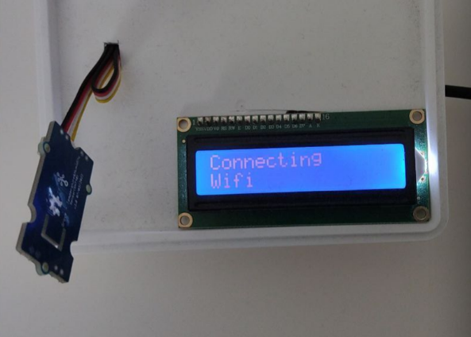

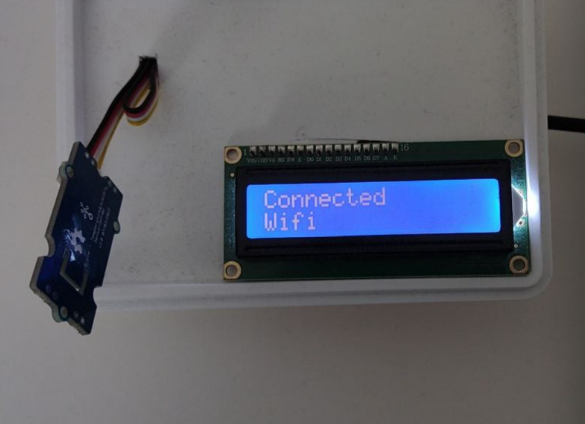

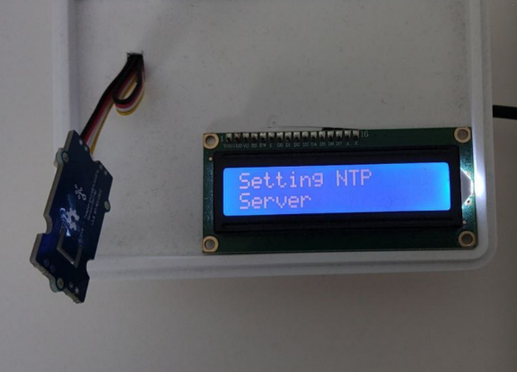

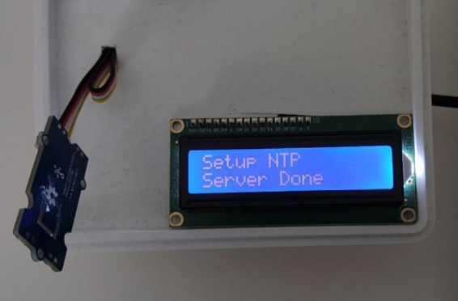

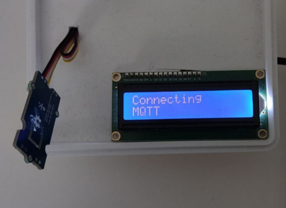

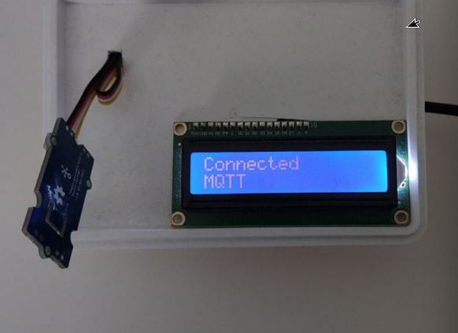

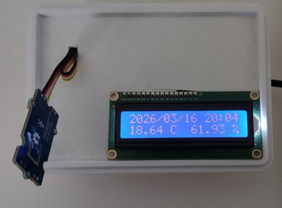

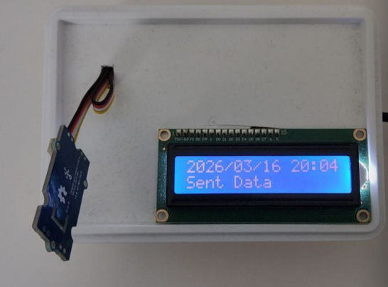

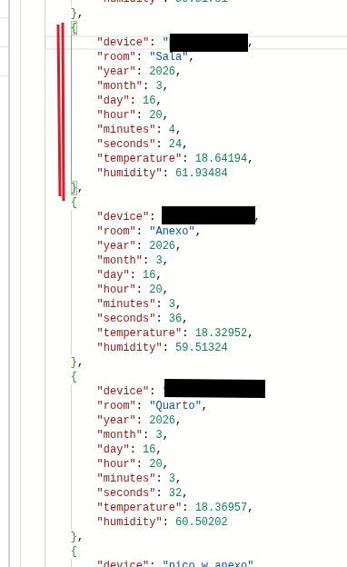

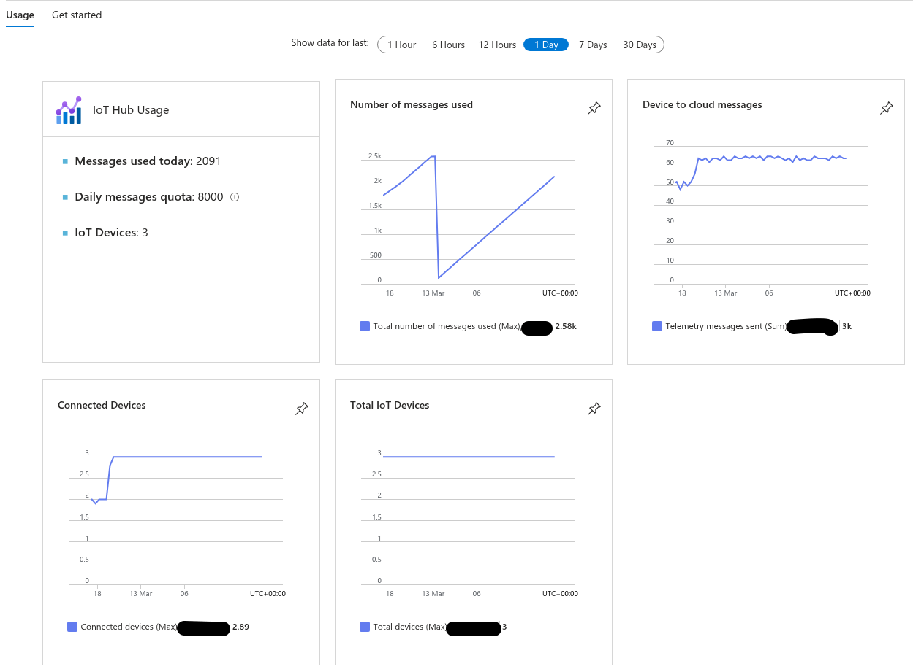

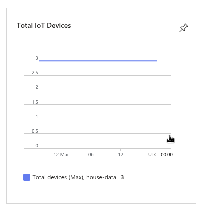


**Query example**

```SQL

SELECT 
c.Body.device, 
c.Body.room, 
c.Body.year, 
c.Body.month,
c.Body.day, 
c.Body.hour, 
c.Body.minutes, 
c.Body.seconds, 
c.Body.temperature["value"] as 'temperature', 
c.Body.humidity["value"] as 'humidity' 
FROM c 
WHERE 1=1 
AND c.Body.year=year(GetCurrentDateTime()) 
AND c.Body.month=month(GetCurrentDateTime()) 
AND c.Body.day = day(GetCurrentDateTime())
--and c.Body.room = 'Anexo'
--and c.Body.room = 'Sala'
--and c.Body.room = 'Quarto'
order by c.DateTime desc
```

**Example of a saved MQTT message**

```json
{
    "id": "8205d094-28a3-4c37-a378-198b2d1e0eea",
    "year": "2025",
    "Properties": {},
    "SystemProperties": {
        "<hidden>-connection-device-id": "<hidden>",
        "<hidden>-connection-auth-method": "{\"scope\":\"device\",\"type\":\"CA-Signed\",\"issuer\":\"<hidden>\"}",
        "<hidden>-connection-auth-generation-id": "638772372462072025",
        "<hidden>-content-type": "application/json;charset=utf-8",
        "<hidden>-enqueuedtime": "2025-03-22T15:16:04.2760000Z",
        "<hidden>-message-source": "Telemetry"
    },
    "iothub-name": "<hidden>",
    "Body": {
        "day": 22,
        "minutes": 16,
        "hour": 15,
        "seconds": 4,
        "temperature": {
            "value": 25,
            "unit": "Celcius"
        },
        "humidity": {
            "value": 65.6,
            "unit": "Percentage"
        },
        "device": "<hidden>",
        "month": 3,
        "room": "Anexo",
        "year": 2025,
        "dataType": "TemperatureHumidity"
    },
    "_rid": "tfgzAPKPk0oGAAAAAAAAAA==",
    "_self": "dbs/tfgzAA==/colls/tfgzAPKPk0o=/docs/tfgzAPKPk0oGAAAAAAAAAA==/",
    "_etag": "\"c9004f4c-0000-0d00-0000-67ded4340000\"",
    "_attachments": "attachments/",
    "_ts": 1742656564
}
```